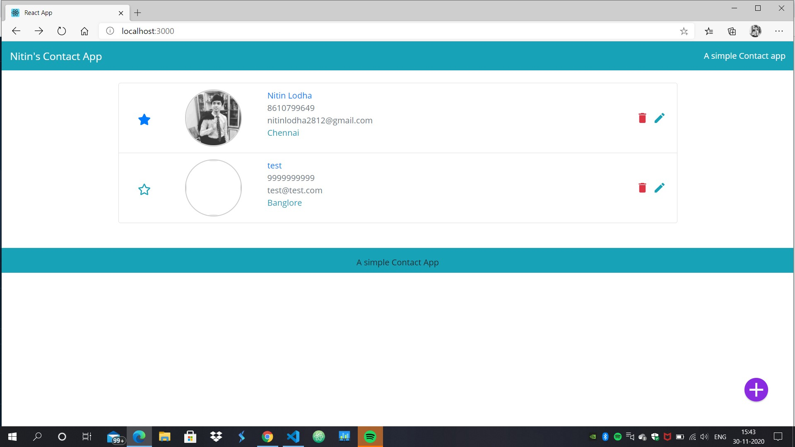
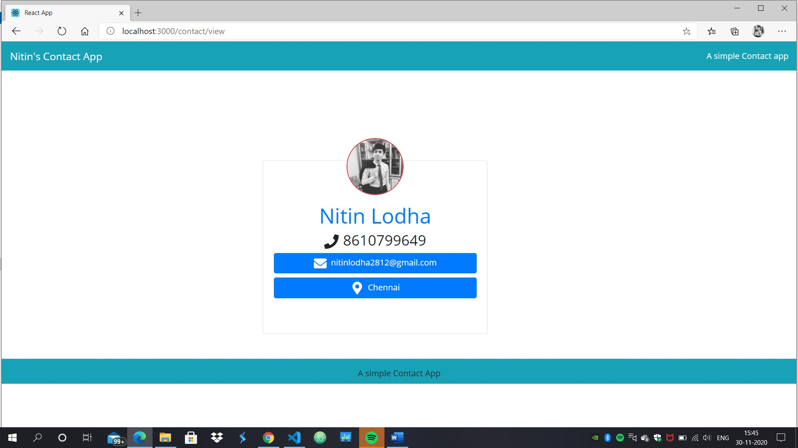
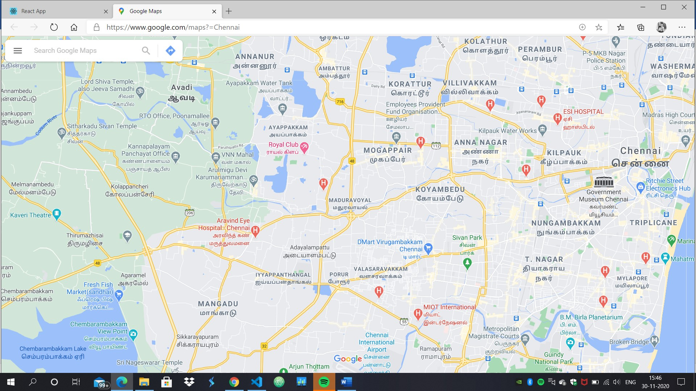
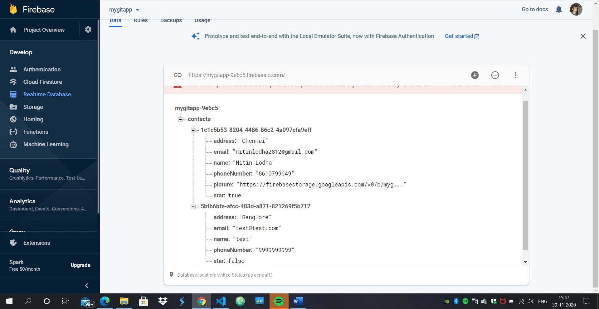

**Project Name**: A Simple Contact Application using React and Firebase

**Published at**: https://damp-badlands-63872.herokuapp.com/

we see the frontend.

The particuar Contact how it looks like

it Has links and the map link is clicked so it shows the location.

How the information we entered looks at the database
